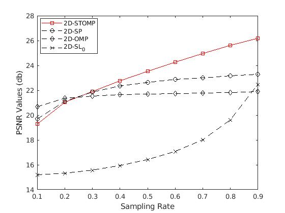
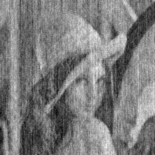
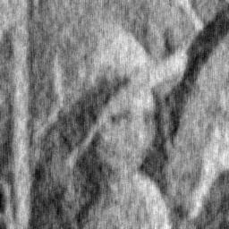
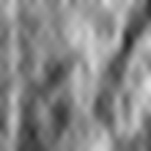
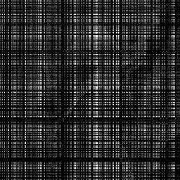

# 2D Stagewise Orthogonal Matching Pursuit
----
Implementation of 2D stagewise orthogonal matching pursuit (2D-StOMP).

Original paper: 2D Stagewise Orthogonal Matching Pursuit. Computer Engineering and Applications.
DOI: 10.3778/j.issn.1002-8331.1810-0040

----
#### Usage

Open it in MATLAB, run PSNR_TIME_SAMRATE_for_2dstomp_lena.m to get a full comparition of reconstruction algorithms under 2D measurement model (2DMM).

It should be as follows:

    
     
    
PSNR-SamplingRate

By the way, the examples of these algorithms are listed as follows with sampling rate 0.55 under 2DMM.

In order: Original lena, 2D-STOMP, 2D-ROMP, 2D-OMP, 2D-SL0.

      

     

----
#### Extra Note
It is noticed that otheralg\fomp22.m is provided by Yong Fong in his blog (iataem.nwsuaf.edu.cn/yfang/). Here provides related paper with high regardness as the 2D-StOMP is based on his works.

[1] Y. Fang, J. Wu, and B. Huang, “2D sparse signal recovery via 2D orthogonal matching pursuit,” Science China Information Sciences, vol. 55, no. 4, pp. 889–897, Apr. 2012.
[2] Y. Fang, “Sparse Matrix Recovery from Random Samples via 2D Orthogonal Matching Pursuit,” CoRR, vol. abs/1101.5755, Jan. 2011.
